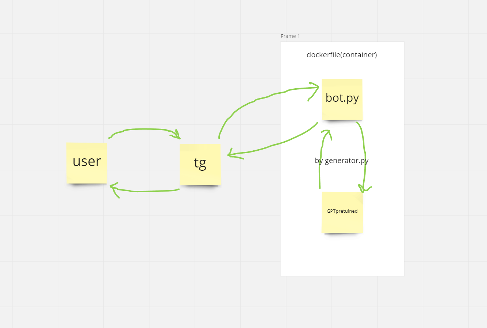
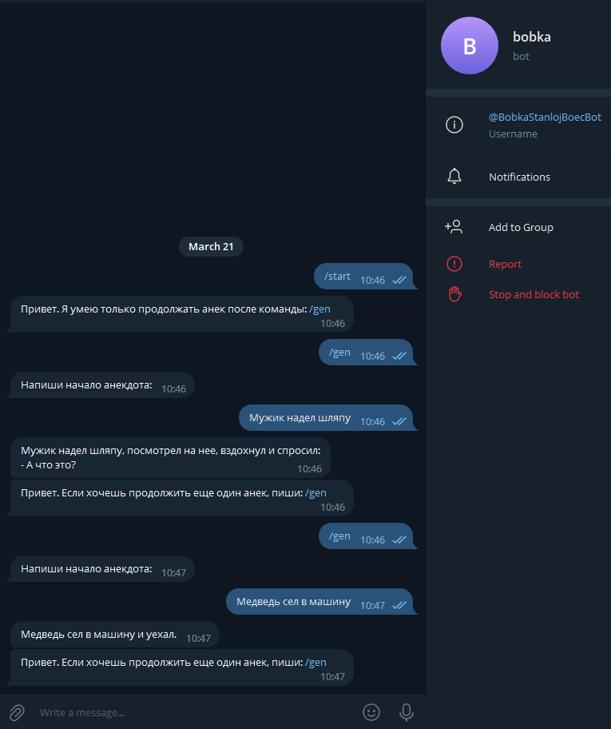

# Генератор анекдотов для ООП
## Задачи
- датасет
- дообучение модели
- бот для генерации
- докерфайл
- оформление репозитория

## Архитектура

## Структура
+ ### [Project](https://github.com/Cuuuube/OOP/tree/main/Project)
+ [bot.py](https://github.com/Cuuuube/OOP/blob/main/Project/bot.py) - бот
+ [generator.py](https://github.com/Cuuuube/OOP/blob/main/Project/generator.py) - класс для бота для работы с GPT
+ [Dockerfile](https://github.com/Cuuuube/OOP/blob/main/Project/Dockerfile) - докер для сборки контейнера
+ ### [Training](https://github.com/Cuuuube/OOP/tree/main/Training)
+ [finetuning.ipynb](https://github.com/Cuuuube/OOP/blob/main/Training/finetuning.ipynb) - Jupyter notebook с обучением модели
+ [anek.txt](https://github.com/Cuuuube/OOP/blob/main/Training/anek.txt) - изначальный датасет с анеками
+ [train_dataset.txt](https://github.com/Cuuuube/OOP/blob/main/Training/train_dataset.txt) - слегка преобразованный и укороченный датасет

## Реализация
Поскольку GPT продолжают текст, то начало будет вводить сам пользователь.
На просторах интернета был найден первый попавшийся датасет с анеками, на основе которого добучалась нейронка. Jupyter notebook c обучением и датасет лежат в папке training.
Бот написан очень простенький на асинхроннной библиотеке aiogram, но со своими задачами справляется. Лежит с нейронкой в папке Project. В той же папке лежит и докерфайл.

# Итог
Иногда бот может выдать что-то забавное, но обычно наваливает кринжа

